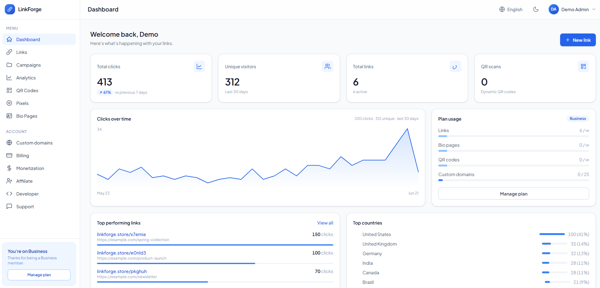

<div align="center">


# LinkForge

**A premium, self-hosted, AI-native URL shortener & link platform.**
Branded short links, a QR studio, link-in-bio pages, deep analytics, monetization, and more — on hosting you own.

[](https://github.com/sanmaxdev/linkforge/actions/workflows/ci.yml)
[](LICENSE)
[](composer.json)
[](https://laravel.com)

</div>

---

LinkForge is a full link-management platform you run on your own server. There is **no license check, no
phone-home, and no subscription** — it's free and open source under the MIT License. Clean, readable code
(no ionCube, no obfuscation) that you can audit, extend, and ship.

<div align="center">
  
</div>

## Features

- **Short links** with custom aliases, expiry, click limits, password protection, a UTM builder, and bulk import.
- **Branded custom domains** — multi-tenant, one-click verification, per-domain analytics.
- **QR Code studio** — styled, scannable codes with colors, shapes, logos, and saved templates.
- **Link-in-bio pages** — a builder with themes, blocks, lead capture, and a live mobile preview.
- **Deep analytics** — click trends, an interactive geo map (built-in GeoIP), device/referrer/UTM breakdowns.
- **AI layer (optional)** — alias ideas, "ask your links" natural-language analytics, title/bio writers, and weekly insights. Bring your own Anthropic or OpenRouter key; with none set, every AI surface hides itself.
- **Targeting & rotation** — geo / device / OS / language / time rules and weighted A/B rotation per link.
- **Monetization** — interstitial ads, link-level ad codes, and built-in retargeting pixels (11 providers).
- **Billing & plans** — Stripe, PayPal, CoinPayments, Crypto.com, or an offline gateway; plan-gated features and credits.
- **Affiliate program**, **blog + help center**, **CMS pages**, **sitemap/robots**, and **cookie consent**.
- **Developer API + webhooks** — token-scoped REST API with HMAC-signed webhook deliveries.
- **Polished admin panel** — users, content moderation, branding/appearance, localization, broadcasts, and a built-in updater.
- **Safety** — local + threat-feed URL screening (URLhaus / VirusTotal / Web Risk), disposable-email blocking, optional Turnstile CAPTCHA.
- **Multi-language**, light/dark themes, white-label branding, and a built-in **demo mode**.

## Tech stack

Laravel 12 · PHP 8.2+ · MySQL/MariaDB · Tailwind CSS 4 · Vite · PHPUnit. No paid services required.

## Requirements

- PHP **8.2+** with the usual Laravel extensions (`pdo`, `mbstring`, `openssl`, `tokenizer`, `xml`, `ctype`, `json`, `bcmath`, `fileinfo`, `curl`, `gd`, `zip`, `sodium`)
- MySQL 5.7+/8 or MariaDB 10.3+
- Composer, and Node.js 18+ (only to build front-end assets)

## Installation

### Production (web installer — no shell needed)

1. Build the assets and install production dependencies, or grab a packaged release from
   [Releases](https://github.com/sanmaxdev/linkforge/releases).
2. Upload the files to your web root and point the document root at `public/`.
3. Create an empty MySQL database.
4. Visit your domain — the **first-run installer** walks you through a requirements check, database +
   `.env` setup (it runs the migrations), and creating your admin account. That's it.
5. Add the scheduler cron so background jobs run:
   ```cron
   * * * * * php /path/to/artisan schedule:run >> /dev/null 2>&1
   ```

### Local development

```bash
git clone https://github.com/sanmaxdev/linkforge.git
cd linkforge
composer install
npm install
cp .env.example .env
php artisan key:generate
# set DB_* in .env, then:
php artisan migrate --seed
npm run build      # or: npm run dev
php artisan serve
```

## Configuration

Everything optional is config-gated and off by default — the app runs fully with just the database set.
Configure the extras you want in `.env` (all documented in `.env.example`):

| Area | Keys |
|---|---|
| AI | `AI_PROVIDER`, `ANTHROPIC_API_KEY` / `OPENROUTER_API_KEY`, `AI_MODEL` |
| Payments | `STRIPE_SECRET`, `PAYPAL_*`, `COINPAYMENTS_*`, `CRYPTOCOM_*` |
| Geo (analytics) | `GEOLITE_DB_PATH` (or use the bundled DB-IP country database / Cloudflare header) |
| Safety | `SAFETY_URLHAUS`, `VIRUSTOTAL_API_KEY`, `WEBRISK_API_KEY`, `TURNSTILE_*` |
| Social login | Google / GitHub / Facebook OAuth credentials (under Admin → Settings) |

Most settings are also editable from **Admin → Settings** at runtime.

## Documentation

Full operator + user docs ship with the app and are served at **`/docs`** on any install
(offline-capable, also at `public/docs/index.html`).

## Updating

Use **Admin → Updates** to upload and apply a release package, or for a Git checkout just `git pull`
followed by `composer install`, `php artisan migrate`, and `npm run build`.

## Demo mode

LinkForge includes a built-in demo mode that turns an install into a safe, read-only public showcase
(one-click logins, hourly reset, no real email). Run it on a **separate** install only — see [DEMO.md](DEMO.md).

## Contributing

Contributions are welcome! Please read [CONTRIBUTING.md](CONTRIBUTING.md) for the dev setup, coding
standards (Laravel Pint), and the PR process. All pull requests run the test suite and linter via CI and
require a maintainer review before merge.

## Security

Found a vulnerability? Please **do not** open a public issue — see [SECURITY.md](SECURITY.md) for private
reporting.

## License

LinkForge is open-source software licensed under the [MIT License](LICENSE). Bundled third-party
software and data are credited in [THIRD_PARTY_LICENSES.md](THIRD_PARTY_LICENSES.md).
